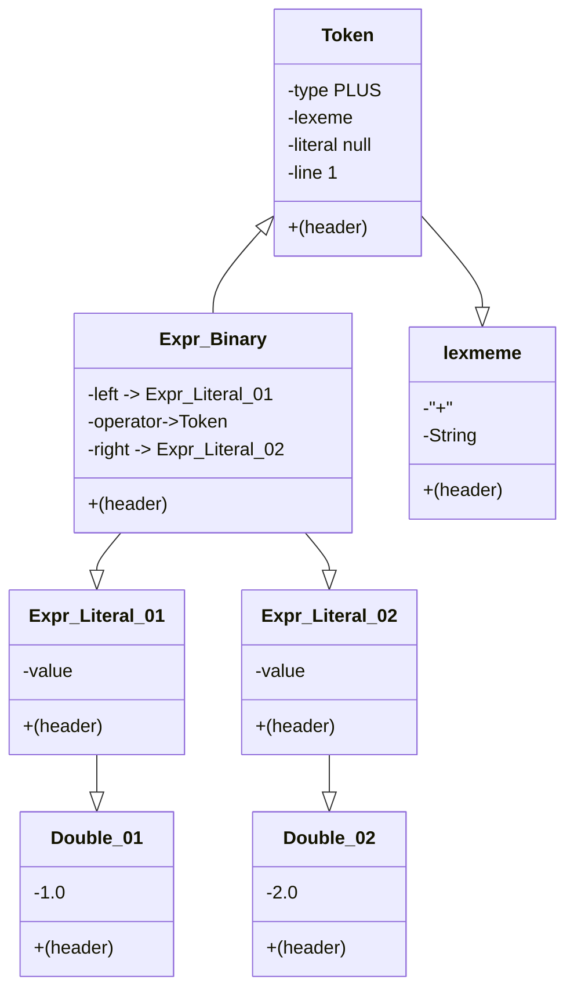

# Ahthor
- David Beazley(https://dabeaz.com/)

# Lexer, Token기본 형태




```
classDiagram
    Expr_Binary --|> Expr_Literal_01
    Expr_Binary --|> Expr_Literal_02
    Expr_Literal_01 --|> Double_01
    Expr_Literal_02 --|> Double_02
    Token <|-- Expr_Binary
    Token --|> lexmeme
    class Expr_Binary{
      +(header)
      -left -> Expr_Literal_01
      -operator->Token
      -right -> Expr_Literal_02
    }
    class Expr_Literal_01{
      +(header)
      -value
    }
    class Expr_Literal_02{
      +(header)
      -value
    }
    class Double_01{
      +(header)
      -1.0
    }
    class Double_02{
      +(header)
      -2.0
    }
    class Token{
      +(header)
      -type PLUS
      -lexeme
      -literal null
      -line 1
    }
    class lexmeme{
      +(header)
      -"+"
      -String
    }
  
```
